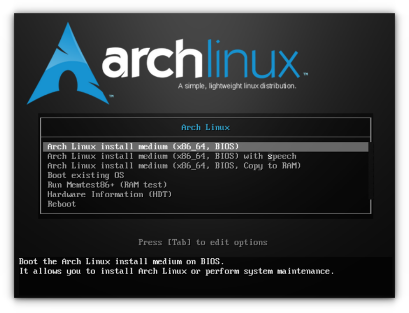

# Guide-Installation-Arch
Mon guide perso qui permet d'installer Arch à la main pas à pas  
Le guide est franco français (pour le moment) et fait par un débutant donc à prendre avec des pincettes car il manque peut être quelques bonnes pratiques  
Les installations on été réalisée en crash-test sur des machines virtuelle VMWare worksation v17.6.2
J'ai pas réinventer la roue on peut tout trouver sur le forum arch mais ça va servir peut être à quelques personne (et surtout à moi si j'ai oublié une commande haha)
Je l'ai fait le plus casual possible comme ça si un débutant tombe dessus il n'aura aucune difficulté à installer 

# Partie à rajouter 
- Corriger les fautes parce je sais pas écrire 
- Gestion en cas de plusieurs disque durs
- Dual-Boot 
- Chiffrement du disque
- Chiffrement du disques avec la TPM
- Partition /home séparer

# Comment savoir quel tuto prendre ?

Lors du boot de l'OS une mini interface apparaitra lorsque c'est en BIOS
comme ceci :


Si vous ne vous souvenez plus aucun problème ! Vous pouvez vérifier directment en commande via 
```shell 
cat /sys/firmware/efi/fw_platform_size 
-> Si la commande renvoi 64 ou 32 = UEFI 
-> Si elle renvoie No such file or directory = BIOS
```

# C'est quoi la différence entre BIOS & UEFI ?


